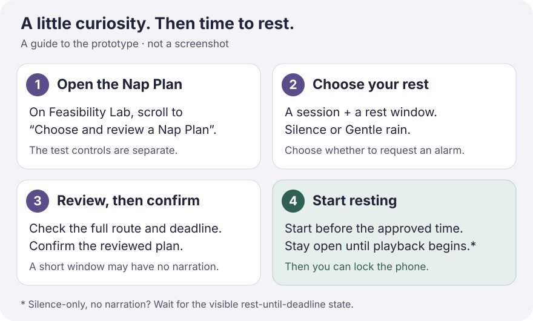
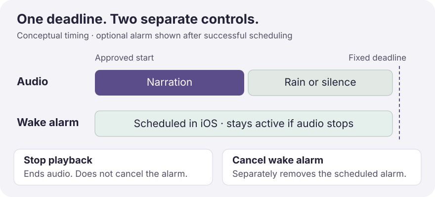

# Honkshool

[](https://github.com/joshuawyadao/Honkshool/actions/workflows/ci.yml)
[](docs/Project-Overview.md)
[](LICENSE)

**Calm stories about how things work, with time left to rest.**

Honkshool is an early-stage iPhone app for calm, uninterrupted factual narration during naps and bedtime. Choose a topic and a rest window, approve what will play, then listen as narration gives way to rain or silence. Relaxation comes first; interesting information is secondary.

The app opens on **Rest**, with **History** nearby and the experimental **Feasibility Lab** under **Settings → Advanced**. Its interface follows the approved [Quiet curiosity design language](docs/Design-Language.md). A Nap Plan uses a reviewed fixed route and deadline; an optional system wake alarm is scheduled and verified separately from audio. Silence is the default and fallback. Runs save verified narration checkpoints locally; rain and silence create no narration history. Reopening never starts audio automatically.

> **Project status:** Feasibility spike plus an early Nap Plan playback flow; there is no supported release. This repository provides source code for contributors and willing testers. Installation currently requires a Mac and Xcode; there is no public App Store or TestFlight installation path documented here.

[Set up the prototype](docs/Getting-Started.md) · [Use the app](docs/User-Guide.md) · [Troubleshooting](docs/Troubleshooting.md) · [All documentation](docs/README.md)

## What can I listen to?

The bundled **How a Car Works** journey has two original, citation-backed sessions, spoken by the prepared Kokoro George voice:

| Session | Narration length | Topic |
| --- | --- | --- |
| **1. Turning Fuel Into Motion** | About 12 minutes | How an engine turns fuel into movement |
| **2. Air, Fuel, and Spark** | About 13 minutes | How air, fuel, and ignition work together |

A longer plan can include both sessions. A short window may contain only rain or silence; the review tells you exactly what fits. Narration plays at its prepared pace. **The rest window is the whole plan, not a promise of time asleep.**

- **Offline playback:** narration and Gentle rain are bundled with the app. No account or streaming service is needed.
- **Your rest sound:** Silence is the default. Gentle rain appears when its bundled file validates; unavailable rain falls back visibly to silence.
- **Optional wake alarm:** request an iOS system alarm for the plan's fixed deadline. Alarm-enabled playback is blocked if permission or scheduling fails.
- **Local listening history:** Continue, Resume, or Replay by reviewing a new plan. Reopening the app never starts audio automatically.

Honkshool describes sessions as **played**. It does not claim subconscious learning, guaranteed retention, therapy, or treatment of insomnia or another medical condition.

## Why this repository is public

- Keep product and engineering decisions reviewable from the beginning.
- Make privacy, security, and contribution expectations explicit as the app evolves.
- Give future work a consistent issue, pull-request, documentation, and verification workflow.
- Avoid implying that unfinished software is ready for end users.

Read the [product brief](docs/Product-Brief.md) for the product boundary, the [design language](docs/Design-Language.md) and [approved screen atlas](design/quiet-curiosity/screen-atlas.html) for the UI direction, the [screen implementation map](docs/Screen-Implementation-Map.md) for every current route and atlas state, the [project implementation plan](docs/Project-Implementation-Plan.md) for the durable phased roadmap, the [decision log](docs/Decision-Log.md) for accepted and unresolved choices, and the [project overview](docs/Project-Overview.md) for a concise status summary.

`docs/Implementation-Plan.md` is intentionally reserved for the current task plan created by the `plan-implement-save` workflow and may be replaced on later implementation branches. Long-lived roadmap updates belong in `docs/Project-Implementation-Plan.md`.

## Repository map

```text
.github/                    Issue forms, pull-request template, and CI
Honkshool/                  Rest-first app, Feasibility Lab, nap domain, and prepared content
HonkshoolTests/             Domain, spike-state, and layout tests
HonkshoolUITests/           Feasibility regressions and Nap Plan review flow
HonkshoolAlarmWidget/       Alarm snooze Live Activity
Honkshool.xcodeproj/        Shared Xcode project and scheme
docs/                       Product context, decisions, status, and roadmap
design/quiet-curiosity/      Approved screen atlas for current and future UI
scripts/                    Verification, iOS tests, and offline audio preparation
tests/                      Publication and repository-safety checks
CODE_OF_CONDUCT.md          Community behavior and private reporting channel
CONTRIBUTING.md             Contribution workflow and quality expectations
SECURITY.md                 Private vulnerability-reporting policy
LICENSE                     MIT license
```

The app opens on Rest, with History nearby and the diagnostic Feasibility Lab under Settings → Advanced. Follow the [device test guide](docs/Feasibility-Spike.md) before drawing conclusions from the spike. Rest offers two ordered prepared automotive sessions—Turning Fuel Into Motion and Air, Fuel, and Spark—with detail and source-linked notes. Time and sound sheets apply only when confirmed, and every selection leads through a fresh route review before playback. Silence is the default; Gentle rain appears when the accepted bundled file and provenance validate. Rain can fill a short plan without narration or follow a completed session; an unavailable or failed rain loop visibly leaves rest in silence without asking the listener to act mid-nap. Settings includes Rest defaults for the next unreviewed plan, the current two-session journey, a verified offline inventory, information about the sole Enthusiast detail level, and an explicit 12-second George preview. The preview writes no history and is unavailable during an active rest or Feasibility Lab audio. Additional journeys, branch destinations, detail variants, voices, and download/delete controls remain unprepared.

## Your first Nap Plan



1. Open Honkshool on the **Rest** tab. If this is your first launch, dismiss the welcome screen. Tap **Change session** to choose one of the two prepared sessions.
2. Choose a rest duration or use **More options** for an exact wake time. Set **After narration** to **Silence** or available **Gentle rain**, and choose whether **Wake alarm** is on.
3. Tap **Review nap plan**. Check the planned start, fixed wake deadline, complete narration route, sound, and alarm choice; tap **Confirm this plan** or **Confirm quiet plan**.
4. Tap **Start resting** before the approved start passes. Keep Honkshool on screen until narration or rain begins, then you can lock the phone. For a silence-only plan with no narration, wait for the visible rest-until-deadline state instead.

The diagnostic **Feasibility Lab** is under **Settings → Advanced**. Its background-audio and test-alarm controls are separate from Nap Plans. The [user guide](docs/User-Guide.md) walks through Rest, History, controls, and interrupted runs.

## Audio and the wake alarm are separate



| I want to… | Use… | What happens |
| --- | --- | --- |
| Pause or continue listening | **Pause playback** / **Resume playback** | The fixed deadline stays the same. |
| End listening early | **Stop playback** | Audio stops; a scheduled wake alarm stays active. |
| Remove the wake alarm | **Cancel wake alarm** after playback stops, or **Cancel Nap Plan wake alarm** in Settings → Advanced → Feasibility Lab | Cancels the separately tracked alarm. Check the displayed result. |
| Listen again later | **History** tab → **Continue listening**, **Resume from…**, or **Replay from start** | Opens a fresh plan for review; nothing starts by itself. |

Audio is intended to end at the fixed deadline even when no alarm is requested. App execution and system scheduling can affect timing; automated passes are not a guarantee of waking. See [current evidence and limitations](docs/Project-Overview.md#current-state).

## Try it or contribute

You need **Xcode 26.6 or newer with compatible iOS platform support**. The app targets **iOS 26 or newer**. A simulator is enough to explore the UI; a signed build on an iPhone is needed for real audio and alarm evaluation.

```sh
git clone https://github.com/joshuawyadao/Honkshool.git
cd Honkshool
open Honkshool.xcodeproj
```

Follow [Getting started](docs/Getting-Started.md) to select a simulator or configure private device signing. Bundled audio is already included; you do not need to generate narration or install an AI model.

For repository checks and the complete simulator suite:

```sh
./scripts/verify-repository.sh
./scripts/test-ios.sh
```

The first command uses shell, Python's standard library, and Git. The second needs full Xcode and an installed simulator. See [Development](docs/Development.md) for destination overrides, the source map, test boundaries, and offline preparation tools. Read [CONTRIBUTING.md](CONTRIBUTING.md) before submitting a change.

## What is still experimental?

1. Completed feasibility validation on the target iPhone: narration, background audio, tested interruptions, Lock Screen controls, AlarmKit, and the larger-text snooze layout (2026-09-15). Squash-merged through PR #2 as `45dcc71`; this remains an experimental console.
2. Implemented and tested the framework-independent Nap Plan, journey, progress, and history rules, squash-merged through PR #3 as `c5025ad`; see the [domain contract](docs/Nap-Planning-Domain.md). Fixed deadlines and short-window fallback follow approved D-004/D-009.
3. Added a [bundled content catalog](docs/Content-Catalog.md) with an original citation-backed automotive session, source metadata, pronunciation guidance, and a complete prepared Kokoro George `0.86` narration. The lossless 727.625-second asset plays through the feasibility console; the planner uses a configurable 730-second estimate. [Audio preparation](docs/Audio-Preparation.md) records narration and CC0 rain provenance. The owner selected the prepared rain candidate for use on 2026-09-28; relative level against narration, longer comfort, and physical-device acceptance remain open.
4. The choose → review screen connects confirmed plans to prepared narration, selected rain or silence, manual controls, a fixed audio cutoff, and optional production AlarmKit scheduling before playback. Alarm identity is kept separately from the feasibility test alarm and can be reconciled or explicitly cancelled after playback stops. SwiftData history retains narration attempts and verified checkpoints across relaunch, with completion-only journey progress and explicit Resume/Replay. Real-iPhone rain, alarm, history, and background-state checks passed; locked-screen controls and listening comfort still need direct observation.
5. Added Air, Fuel, and Spark as the second prepared George session, merged through PR #10 as `19f4339`. Continue follows completion evidence to the next session or its saved partial position; a long plan can approve both sessions before playback. The next milestone is an approximately ten-nap personal validation trial. The [trial guide](docs/Ten-Nap-Trial.md) provides setup, a blank private-log template, and decision criteria; actual use and deferred manual audio observations remain pending.
6. Approved the 33-screen Quiet curiosity direction and applied its Rest-first shell, plan/recovery flow, and History. The current catalog supports functional session and journey browsing, source notes, packaged-audio inventory, Rest defaults, and a bounded George preview. The [screen implementation map](docs/Screen-Implementation-Map.md) separates those routes from the atlas's unprepared extra content and choices; release and device acceptance remain separate from the recorded simulator UI validation.

The next milestone is the [approximately ten-nap personal trial](docs/Ten-Nap-Trial.md). More content, branching navigation, and additional prepared voices remain later work. See the [project overview](docs/Project-Overview.md) and [durable roadmap](docs/Project-Implementation-Plan.md) for details. The replaceable task plan lives in [docs/Implementation-Plan.md](docs/Implementation-Plan.md).

## Privacy, help, and reuse

The app has no backend, account, analytics, or app-managed cloud sync. Listening history and preferences are stored locally; alarm scheduling uses iOS. There is currently no in-app history delete/export control. Read [Privacy and local data](docs/Privacy.md) for storage, backups, and reset limits.

Use [Troubleshooting](docs/Troubleshooting.md) for setup or playback problems. Report ordinary bugs through [GitHub issues](https://github.com/joshuawyadao/Honkshool/issues), using synthetic examples and redacted details. Report vulnerabilities privately through [SECURITY.md](SECURITY.md). Community expectations are in the [Code of Conduct](CODE_OF_CONDUCT.md).

Code and the original documentation diagrams use the [MIT License](LICENSE). The rain recording uses CC0 1.0. The two generated George recordings have separate model/source and preparation records; see [audio provenance](docs/Audio-Preparation.md) and [content sources](docs/Content-Catalog.md) before reusing assets. The code-license badge does not describe third-party source material.
