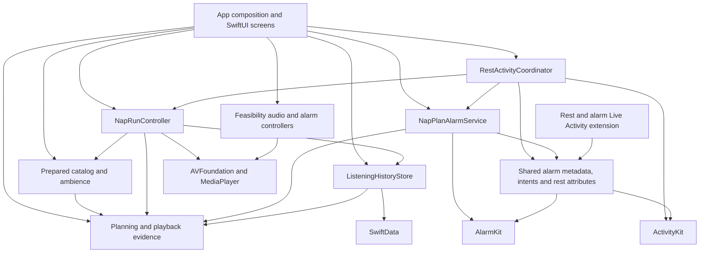

# Architecture

Honkshool has one iPhone app target and a small rest-countdown and AlarmKit Live Activity extension. The app contains a Foundation-only planning domain, bundled content validation, platform adapters, and SwiftUI presentation. These are conceptual modules within the app target, not separate Swift packages.

## Dependency direction



The planning domain never imports SwiftUI, SwiftData, AVFoundation, or AlarmKit. The app's composition root constructs concrete adapters; this outward knowledge belongs there. Offline preparation scripts produce versioned bundled assets and do not become runtime dependencies.

## Ownership and invariants

| Module | Owns | Contract |
|---|---|---|
| `Domain/NapContent`, `NapPlan`, `NapPlanReview` | Content identity, deterministic allocation, immutable reviewed route | Time and availability are explicit inputs. Confirmation cannot silently replace an approved plan. |
| `Domain/NapPlayback` | Played evidence, checkpoints, completion and journey progress | Estimates do not prove completion. The deadline stays fixed and partial evidence remains distinct from completion. |
| `Content/PreparedCatalog`, `PreparedAmbience` | Catalog validation, revision/render identity, bundled resource availability | Only valid prepared content is offered. Missing audio does not trigger a different voice or runtime generation. |
| `Services/NapRunController`, `NapAmbiencePlayer` | Approved playback, controls, interruptions, fixed cutoff and checkpoints | Explicit resume after interruption/output loss; stale callbacks cannot restart a stopped run. Rain creates no narration history. |
| `Services/NapPlanAlarmService` | Production wake-alarm identity, schedule/readback, reconciliation and cancellation | An alarm-requested run requires matching verified evidence. Playback Stop preserves the separately scheduled alarm. |
| `Services/RestActivityCoordinator` | Fixed rest countdown admission, updates and reconciliation | Starts after admitted playback/rest; verified alarm identity may preserve the card after Stop/relaunch. Serial mutations prevent old updates winning over cleanup. Labels describe the last local update, since external alarm changes can precede foreground reconciliation. Disabled ActivityKit is nonfatal. |
| `Services/ListeningHistoryStore` | Local SwiftData transactions, checkpoint replacement, recovery and retry | Completion alone advances progress. Errors remain visible and do not replace a failed store with an empty one. |
| `App` | Dependency composition, Rest and History navigation, user review, Settings and diagnostic access | Reopening never starts audio; Continue/Resume/Replay require a fresh review. |
| `Shared` and `HonkshoolAlarmWidget` | Alarm metadata/intents, rest timing attributes and system-hosted presentation | The widget shares narrow timing and alarm types rather than app navigation or history state. |

The [domain contract](Nap-Planning-Domain.md) defines timing and persistence details. The [decision log](Decision-Log.md) owns product choices such as alarm ownership and offline preparation.

## Feasibility and ordinary use

The app opens on the Rest tab, with History as the other tab. Settings opens from Rest and places Feasibility Lab under Advanced. The root view retains the production run, alarm, and history objects across both tabs and the Settings route. Feasibility audio and alarms remain separate from production Nap Plans; their contracts and stored alarm identities differ. The bounded narration preview uses verified bundled audio and stops when its page closes.

The Feasibility Lab bounds its saved test duration to 5–180 minutes. Separately, Rest defaults are bounded to 1–180 minutes and apply to the next timer or unreviewed narrated plan; a confirmed plan keeps its reviewed timing and sound. The shared Rest sound starts as timer rest begins and is used during any quiet time before or after narration in narrated plans.

The September 2026 checkup found no confirmed dependency cycle or need for broad restructuring. The later Rest-first UI moved ordinary navigation while keeping runtime ownership at the app root. The [screen implementation map](Screen-Implementation-Map.md) identifies each reachable state and its source view.

## Test seams and verification

- Planner and playback rules accept explicit time and immutable values, so their tests need no real sleep or alarm.
- Runtime tests replace the clock, scheduler, audio player, and history recorder while asserting observable state and evidence.
- Alarm tests use the `AlarmSystem` seam; SwiftData tests exercise temporary/in-memory stores, disk reopen, corruption and retry.
- Integration tests validate actual bundled assets and AVFoundation completion, and render the rest countdown and alarm layouts at larger text sizes. An isolated simulator opt-in also exercises the real WidgetKit host and recognizes its screenshot text; accessibility labels alone can remain present when archived text fails to paint.
- The active Rest page uses the admitted run’s immutable start/deadline for native countdown text. Presentation separates pause/interruption from rest time and changes to ended at the fixed deadline without moving it.
- UI tests require Debug builds and the `-ui-testing` launch argument. Their isolated preferences/history and simulated alarms protect normal app data. Saved-duration fixtures can exercise invalid restored values without touching ordinary preferences.
- Physical opt-in tests are separate. Simulator passes do not establish audibility, headphone behavior, Lock Screen control behavior, or subjective comfort.

Run `./scripts/verify-repository.sh` for the portable gate and `./scripts/test-ios.sh` for the full simulator gate. The latter remains the CI default. For a focused local domain/controller iteration, Xcode can select the unit/integration target directly:

```sh
DEVELOPER_DIR=/Applications/Xcode.app/Contents/Developer xcodebuild -quiet \
  -project Honkshool.xcodeproj -scheme Honkshool \
  -destination 'platform=iOS Simulator,name=iPhone 17 Pro,OS=latest' \
  -parallel-testing-enabled NO -only-testing:HonkshoolTests test
```

Choose an installed destination and still run the full gate for app changes. This targeted command does not replace UI or device validation. The [feasibility guide](Feasibility-Spike.md) records physical evidence and remaining observations; the [trial guide](Ten-Nap-Trial.md) owns ordinary-use evaluation.
