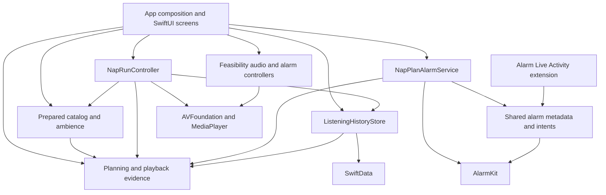

# Architecture

Honkshool has one iPhone app target and a small AlarmKit Live Activity extension. The app contains a Foundation-only planning domain, bundled content validation, platform adapters, and SwiftUI presentation. These are conceptual modules within the app target, not separate Swift packages.

## Dependency direction



The planning domain never imports SwiftUI, SwiftData, AVFoundation, or AlarmKit. The app's composition root constructs concrete adapters; this outward knowledge belongs there. Offline preparation scripts produce versioned bundled assets and do not become runtime dependencies.

## Ownership and invariants

| Module | Owns | Contract |
|---|---|---|
| `Domain/NapContent`, `NapPlan`, `NapPlanReview` | Content identity, deterministic allocation, immutable reviewed route | Time and availability are explicit inputs. Confirmation cannot silently replace an approved plan. |
| `Domain/NapPlayback` | Played evidence, checkpoints, completion and journey progress | Estimates do not prove completion. The deadline stays fixed and partial evidence remains distinct from completion. |
| `Content/PreparedCatalog`, `PreparedAmbience` | Catalog validation, revision/render identity, bundled resource availability | Only valid prepared content is offered. Missing audio does not trigger a different voice or runtime generation. |
| `Services/NapRunController`, `NapAmbiencePlayer` | Approved playback, controls, interruptions, fixed cutoff and checkpoints | Explicit resume after interruption/output loss; stale callbacks cannot restart a stopped run. Rain creates no narration history. |
| `Services/NapPlanAlarmService` | Production wake-alarm identity, schedule/readback, reconciliation and cancellation | An alarm-requested run requires matching verified evidence. Playback Stop preserves the separately scheduled alarm. |
| `Services/ListeningHistoryStore` | Local SwiftData transactions, checkpoint replacement, recovery and retry | Completion alone advances progress. Errors remain visible and do not replace a failed store with an empty one. |
| `App` | Dependency composition, user review, controls and history navigation | Reopening never starts audio; Continue/Resume/Replay require a fresh review. |
| `Shared` and `HonkshoolAlarmWidget` | Alarm metadata/intents and system-hosted presentation | The widget shares narrow alarm types rather than app navigation or history state. |

The [domain contract](Nap-Planning-Domain.md) defines timing and persistence details. The [decision log](Decision-Log.md) owns product choices such as alarm ownership and offline preparation.

## Feasibility and ordinary use

The app currently opens the Feasibility Lab, which also owns the production runtime objects and links to Nap Plan review and listening history. Feasibility audio and alarms remain separate from production Nap Plans; merging their implementations would conflate their different contracts and stored alarm identities.

The console bounds saved rest defaults to 5–180 minutes when loading them. An out-of-range stored value is repaired before it is displayed or selected, so the Saved button, custom value, and calculated wake deadline agree.

The September 2026 checkup found no confirmed dependency cycle or need for broad restructuring. A dedicated ordinary entry could improve navigation if the personal trial demonstrates friction. It would relocate presentation and must preserve runtime ownership; the [roadmap](Project-Implementation-Plan.md) defers home-screen redesign until there is that evidence.

## Test seams and verification

- Planner and playback rules accept explicit time and immutable values, so their tests need no real sleep or alarm.
- Runtime tests replace the clock, scheduler, audio player, and history recorder while asserting observable state and evidence.
- Alarm tests use the `AlarmSystem` seam; SwiftData tests exercise temporary/in-memory stores, disk reopen, corruption and retry.
- Integration tests validate actual bundled assets and AVFoundation completion, and render the alarm layout at larger text sizes.
- UI tests require Debug builds and the `-ui-testing` launch argument. Their isolated preferences/history and simulated alarms protect normal app data. Saved-duration fixtures can exercise invalid restored values without touching ordinary preferences.
- Physical opt-in tests are separate. Simulator passes do not establish audibility, headphone behavior, Lock Screen control behavior, or subjective comfort.

Run `./scripts/verify-repository.sh` for the portable gate and `./scripts/test-ios.sh` for the full simulator gate. The latter remains the CI default. For a focused local domain/controller iteration, Xcode can select the unit/integration target directly:

```sh
DEVELOPER_DIR=/Applications/Xcode.app/Contents/Developer xcodebuild -quiet \
  -project Honkshool.xcodeproj -scheme Honkshool \
  -destination 'platform=iOS Simulator,name=iPhone 17 Pro,OS=latest' \
  -parallel-testing-enabled NO -only-testing:HonkshoolTests test
```

Choose an installed destination and still run the full gate for app changes. This targeted command does not replace UI or device validation. The [feasibility guide](Feasibility-Spike.md) records physical evidence and remaining observations; the [trial guide](Ten-Nap-Trial.md) owns ordinary-use evaluation.
